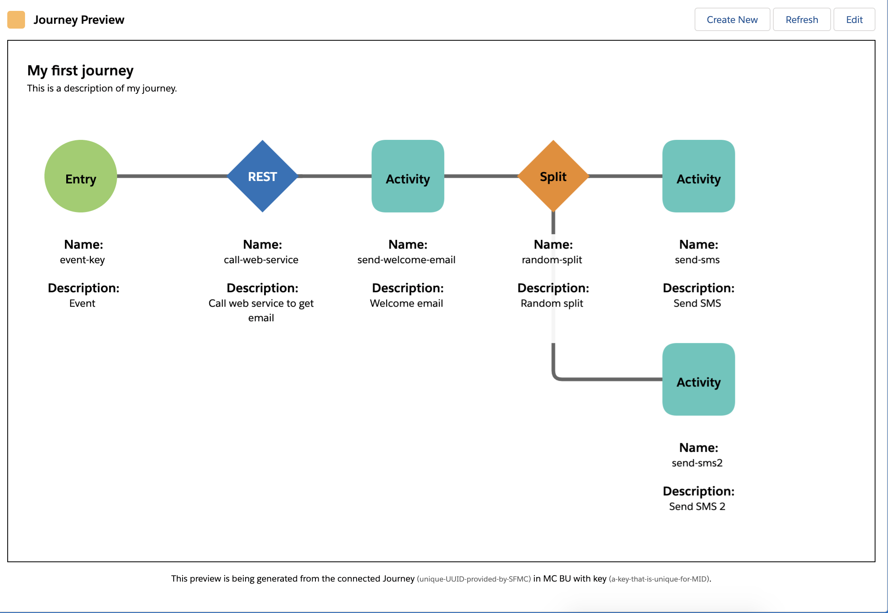

# LWC - Journey Builder Spec Preview
## Salesforce Lightning Web Component Cross-Cloud Magic

This Lightning Web Component is designed to be used with the core Salesforce Platform to visualize a Journey from Salesforce Marketing Cloud in the context of Sales, Service, or Community Cloud. 

This component ingests [a JSON spec of a Journey via the Marketing Cloud APIs](https://developer.salesforce.com/docs/atlas.en-us.noversion.mc-apis.meta/mc-apis/reference.htm).

## Preview

## Prereqs
* A valid Marketing Cloud org with a server-to-server integration set up
    * The `client_id` and `client_secret` for the above
* A core Salesforce org to deploy your component in
* Knowledge of custom metadata types

## Deployment
* Set up your Marketing Cloud account with a new custom package with an API integration component
* Use SFDX to deploy the source to your desired org
* Change the Remote Site Settings for `MarketingCloudRESTURL` and `MarketingCloudAuthURL` to whitelist the `auth` and `rest` endpoints for your instance of Marketing Cloud
* Add a record to the `Marketing Cloud Credentials` custom record type named `MCCConfig` with the following attributes populated based on your MC app details:
    * `Client_ID__c`
    * `Client_Secret__c`
    * `AUTH_URL__c`
    * `REST_URL__c`
* Add the `lwcJourneyBuilderPreview` component to your desired page
* Configure the component's attributes to feed in the Journey ID and URLs for your Marketing Cloud instance

## To Do
* Swap out hard-coded stub with real JSON payload via MC APIs
* Wire up component properties to make this something that can be more easily reused.